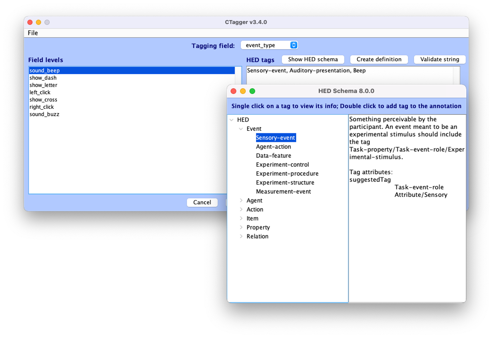

# CTagger

The Hierarchical Event Descriptor (HED) is a standard for the description of experiment events in neuroimaging data. HED enables the detailed, human-readable, and machine-actionable annotation of events happened in neuroimaging experiments, making shared data analysis-ready. To learn more information about the HED standards and examples, see [hedtags.org](https://www.hedtags.org).

CTagger is a graphical interface to assist HED users with the event annotation process, allowing easy navigation around fields of the event table, automatic tags suggestions and validation, as well as the ability to browse the HED schema during annotation. CTagger can be used as a standalone desktop application or as part of the EEGLAB's plug-in [*HEDTools*](https://www.hed-resources.org/en/latest/HedMatlabTools.html#eeglab-plug-in-integration). This repository contains the source code for CTagger, and is also the place where users can submit bug reports and request new features through Github issues tracking system. Detailed documentation on how to use CTagger with walk-through tutorial can be found at our [official HED  documentation site](https://www.hed-resources.org/en/latest/CTaggerGuiTaggingTool.html).

