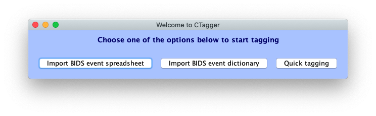
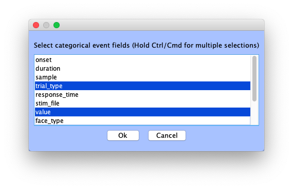
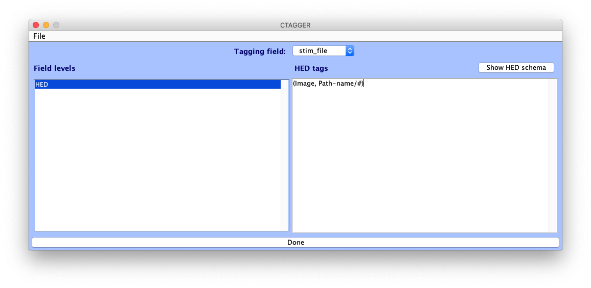
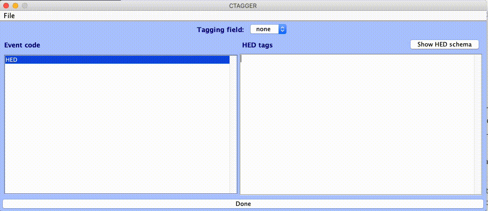
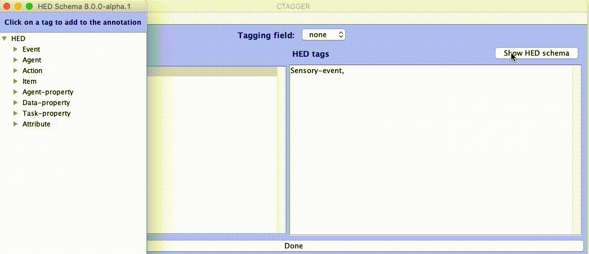
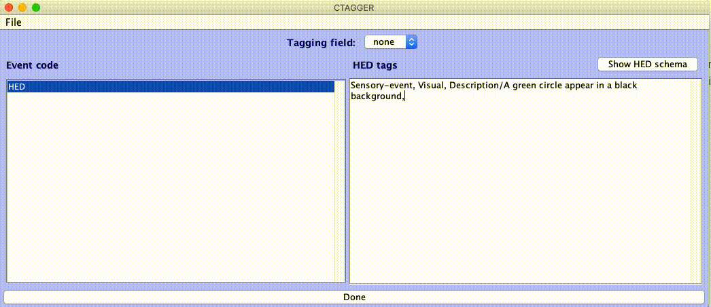
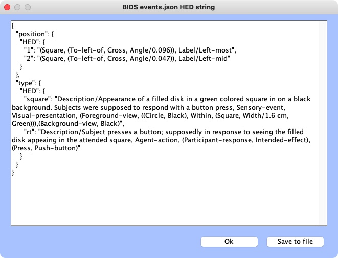
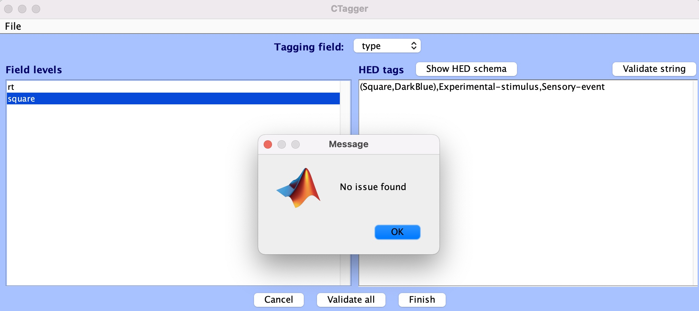

# CTagger user guide

This guide covers everything you need to know about CTagger: what it is, how to install it, and how to use it to add HED annotations to your neuroimaging experiment events. CTagger can be used as a standalone application or as part of the EEGLAB BIDS data pipeline.

## What is HED?

HED (Hierarchical Event Descriptors) is a framework for systematically describing events and experimental metadata in machine-actionable form. HED provides:

- **Controlled vocabulary** for annotating experimental data and events
- **Standardized infrastructure** enabling automated analysis and interpretation
- **Integration** with major neuroimaging standards (BIDS and NWB)

For more information, visit the HED project [homepage](https://www.hedtags.org) and the [resources page](https://www.hedtags.org/hed-resources).

## What is CTagger?

**CTagger** is a desktop application that provides a graphical user interface for creating HED annotations. It helps researchers annotate their experimental events using HED tags through:

- **Interactive tag input** with real-time search and autocomplete
- **Schema browser** for exploring available HED tags
- **Validation** to ensure annotations conform to HED schema rules
- **BIDS support** for importing/exporting event files and sidecars
- **Field-level tagging** for both categorical and continuous event data

CTagger is particularly useful for:

- Researchers new to HED who want visual guidance for tag selection
- Annotating BIDS datasets with complex event structures
- Exploring HED schema hierarchies interactively
- Creating HED annotations without writing code

## Related tools and resources

- **[HED homepage](https://www.hedtags.org)**: Overview and links for HED

- **[HED resources](https://www.hedtags.org/hed-resources)**: Comprehensive tutorials and documentation

- **[HED schema browser](https://www.hedtags.org/hed-schema-browser)**: Browser for HED vocabularies

- **[HED specification](https://www.hedtags.org/hed-specification/)**: Formal specification defining HED annotation rules

- **[HED online tools](https://hedtools.org/hed)**: Web-based tools requiring no installation

- **[Python HEDTools](https://www.hedtags.org/hed-python)**: Python library for HED validation and analysis

- **[MATLAB HEDTools](https://www.hedtags.org/hed-matlab)**: MATLAB library for HED validation and analysis

- **[HED examples](https://github.com/hed-standard/hed-examples)**: Example datasets annotated with HED

- **[BIDS specification](https://bids-specification.readthedocs.io)**: Brain Imaging Data Structure specification

## Download and installation

### Requirements

CTagger requires **Java Runtime Environment (JRE) 8 or higher**. Most systems come with Java pre-installed.

To check if Java is installed, run in a terminal:

```bash
java -version
```

You should see output like `java version "1.8.0_211"` or `openjdk version "11.0.11"` or higher.

If Java is not installed, download and install it from:

- [Adoptium](https://adoptium.net/) (recommended)
- [Oracle](https://www.oracle.com/java/technologies/downloads/)

### Standalone installation

1. **Download CTagger.jar** from the [releases page](https://github.com/hed-standard/ctagger/releases)

2. **Run the application** by double-clicking `CTagger.jar`

   **macOS users**: You may need to update Security settings to allow the app to run.

   **Linux users**: You might need to make the jar executable first:

   ```bash
   chmod +x CTagger.jar
   ```

### EEGLAB plugin

CTagger is integrated into EEGLAB through the **HEDTools plugin**:

1. In EEGLAB, go to **File → Manage EEGLAB extensions**
2. Install the **HEDTools** plugin
3. After loading a dataset, HED options appear in the **Edit** menu

## Quick start

1. **Launch CTagger** by running the JAR file
2. **Import a BIDS file**:
   - Import `events.json` sidecar (automatically detects categorical fields)
   - Or import `events.tsv` file (you specify categorical fields)
3. **Select a field** from the "Tagging field" dropdown
4. **Select a value** (for categorical fields) from the "Field levels" panel
5. **Build your HED annotation** using:
   - Type to search for tags (autocomplete suggestions appear)
   - Click "Show HED schema" to browse the tag hierarchy
   - Press Enter to insert selected tags
6. **Validate** your annotations with the "Validate string" button
7. **Save** your work:
   - Copy to clipboard for manual use
   - Save as JSON dictionary for BIDS integration

## Building from source

### Prerequisites

- **Java JDK 8 or higher** (tested with JDK 21)
- **Gradle 8.5+** (wrapper included in repository)

### Build instructions

```bash
# Clone the repository
git clone https://github.com/hed-standard/ctagger.git
cd ctagger

# Build the JAR
./gradlew jar

# On Windows:
gradlew.bat jar

# The compiled JAR will be at:
# build/libs/CTagger.jar
```

### Running locally

After building:

```bash
java -jar build/libs/CTagger.jar
```

## Loading BIDS event files

From the CTagger launcher window, you can import either BIDS event dictionaries or event spreadsheets to start tagging.



### Importing JSON sidecars

If you select **Import BIDS event dictionary**, you'll be prompted to choose an `events.json` file. CTagger will automatically:

- Identify fields with the "Levels" key as categorical columns
- Consider each sub-level as a categorical value for that field
- Treat all other fields as having continuous values

### Importing tabular files

If you select **Import BIDS event spreadsheet** and choose an `events.tsv` file, CTagger will ask you to specify which fields are categorical.



Once you specify the categorical fields, CTagger will automatically extract the unique categorical values from the file.

## The main tagging interface

After importing, you'll see the main CTagger tagging interface:



### Interface components

1. **Tagging field dropdown**: Toggle between different fields (event columns)

2. **Field levels panel** (left side):

   - For **categorical fields**: Lists all unique values for the selected field
   - For **continuous/value fields**: Shows a single **HED** item where you can specify a template using the `#` symbol

3. **Tag editor panel** (right side):

   - Build your HED annotation here
   - Tags are inserted as you type or select them

### Important usage notes

- **Always select an item** from the Field levels list before building your annotation
- The HED string you create will be associated with the selected item
- If no item is selected, your HED string will not be saved

You are now ready to start tagging!

## Building HED annotations

CTagger provides several features to help you quickly and easily construct HED annotations.

### Tag search and autocomplete

As you type in the tag editor, CTagger compares your input to all schema nodes and displays matching tags in the **Search Results** box below the cursor.

**Navigation**:

- Press the **down-arrow key** to scroll through results
- Press **Enter/Return** to select and insert a tag
- Or click on a tag with your mouse to select it

**Behavior**:

- CTagger inserts the **short-form** tag, replacing your input sequence
- The Search Results box disappears after selection
- Press **Esc** or click outside the box to dismiss it without selecting

Tags are matched case-insensitively against their **long-form** representation.



### HED schema browser

Click the **Show HED schema** button to browse the HED schema hierarchy interactively.

**Features**:

- Expand/collapse nodes that contain children
- Click on any node to insert its **short-form** tag
- For nodes that take values, click the **#** symbol underneath to insert the node name followed by `/`
- After insertion, type the value for that node



### Tag groups

In HED, tags can be grouped together using parentheses to indicate they modify each other and should be interpreted as a unit.

**Examples**:

- `(Triangle, Green)` describes a green triangle
- Nested groups can describe more complex relationships

**Formatting in CTagger**:

- Use **Newline** and **Tab** keys to format nested groups for readability
- CTagger will automatically strip newlines and tabs from the final HED string
- This ensures compatibility with BIDS and other formats



### Reviewing tags

At any time during annotation, you can view the current (even if incomplete) long-form HED string:

- Go to **File → Review all tags**



This displays your annotation in the full, long-form format.

## Validation

### Validating individual strings

Click the **Validate string** button to check the currently displayed HED string against the schema rules.



CTagger will report any errors and provide guidance on how to fix them.

### Validating all annotations

Click the **Validate all** button to validate the entire event file's annotations at once.

This checks all field-level annotations you've created across all fields and categorical values.

**Important**: You must fix all validation errors before finishing and saving your annotations.

## Saving your work

Once you've completed your annotations and validation passes without errors:

### Copy to clipboard

Select **Finish → Copy to clipboard** to copy your HED annotations. You can then paste them into another file or application.

### Save as JSON dictionary

Select **Finish → Save to file**:

1. Provide a filename for your JSON file
2. Choose where to save it
3. CTagger saves the annotations in BIDS-compatible JSON format

The JSON dictionary maps field names and categorical values to their HED strings, ready for use with BIDS datasets.

## Tips and best practices

### Value fields with templates

For continuous/value fields (like `duration`, `response_time`), use the `#` placeholder in your template:

```
Duration/# ms
```

This template will be applied with the actual value from each event row substituted for `#`.

### Organizing complex annotations

For complex event structures with many tag groups:

1. Use newlines and tabs to indent nested groups
2. This makes it easier to see the structure while editing
3. CTagger removes formatting when saving, maintaining BIDS compatibility

### Iterative validation

Validate frequently as you build annotations:

- Fix errors early before they compound
- Use validation messages to learn HED rules
- Validate individual strings first, then validate all at the end

### Working with multiple fields

- Complete one field at a time
- Use the field dropdown to switch between fields
- Validate each field's annotations before moving to the next

### Schema versions

- CTagger loads the HED schema from the official repository or local files
- Ensure you're using the appropriate schema version for your dataset
- Schema version should match what's specified in your BIDS dataset

## Keyboard shortcuts

| Action                  | Shortcut                               |
| ----------------------- | -------------------------------------- |
| Insert newline          | Enter (when not selecting from search) |
| Add tab indentation     | Tab                                    |
| Dismiss search results  | Esc                                    |
| Navigate search results | Up/Down arrow keys                     |
| Select from search      | Enter/Return                           |

## Troubleshooting

### Validation errors

**Problem**: Tags are marked as invalid

**Solutions**:

- Check spelling and capitalization (use search/browser)
- Ensure required children are included (consult schema)
- Verify tag groups are properly closed with parentheses
- Check that value fields have appropriate units

### Tags not saving

**Problem**: Built annotations don't appear in output

**Solutions**:

- Ensure an item is selected in the Field levels panel
- Check that you've clicked into the tag editor area
- Verify you're on the correct field in the dropdown

### Schema not loading

**Problem**: Can't see schema tags or autocomplete doesn't work

**Solutions**:

- Check internet connection (if loading from repository)
- Try loading a local schema file
- Restart CTagger
- Check Java version is 8 or higher

### BIDS file import issues

**Problem**: Can't import events.json or events.tsv

**Solutions**:

- Verify file is valid JSON/TSV format
- Check that events.json has proper BIDS structure
- Ensure categorical fields are properly defined with "Levels" key
- Try importing as TSV and manually specifying categorical fields

## Getting help

- **Documentation**: This guide and the [HED resources page](https://www.hedtags.org/hed-resources)
- **Issues**: Report bugs or request features on [GitHub Issues](https://github.com/hed-standard/ctagger/issues)
- **HED Forum**: Ask questions on the [HED discussions forum](https://github.com/hed-standard/hed-specification/discussions)
- **Email**: Contact the HED team at hed.maintainers@gmail.com
